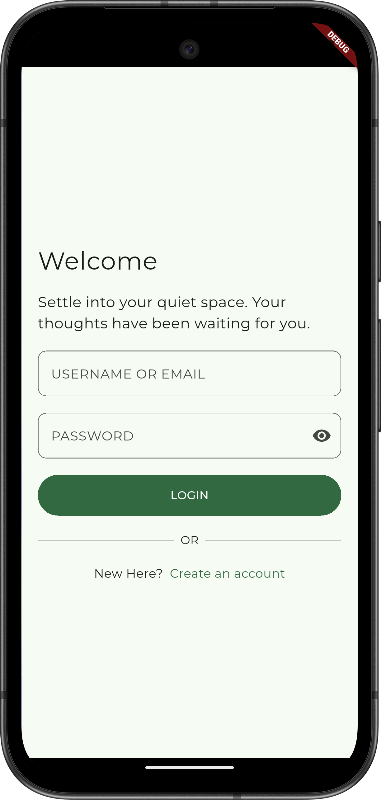
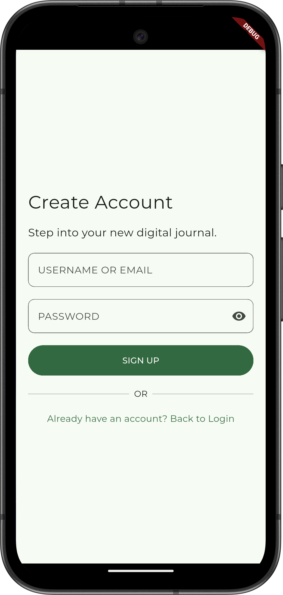
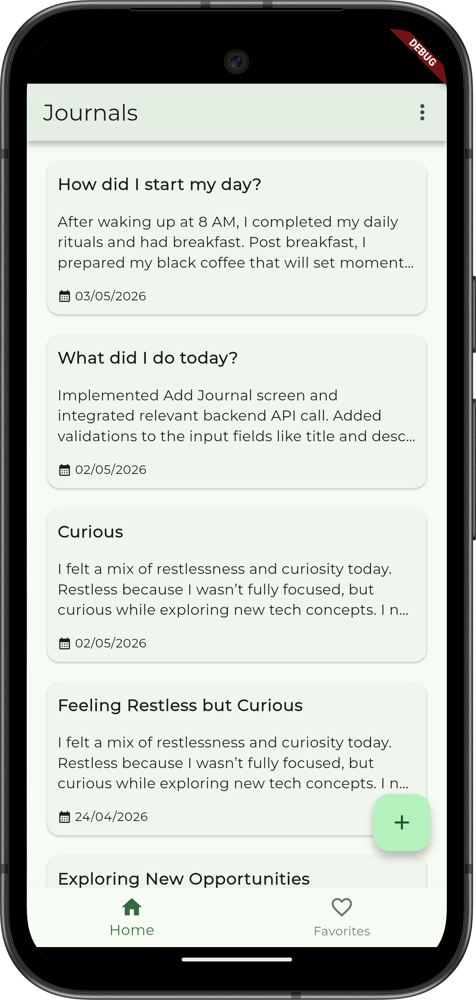
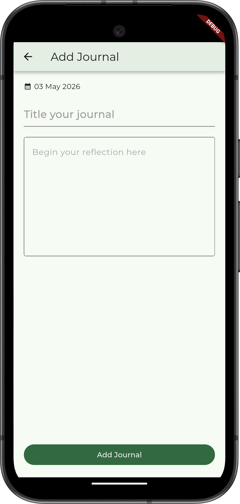
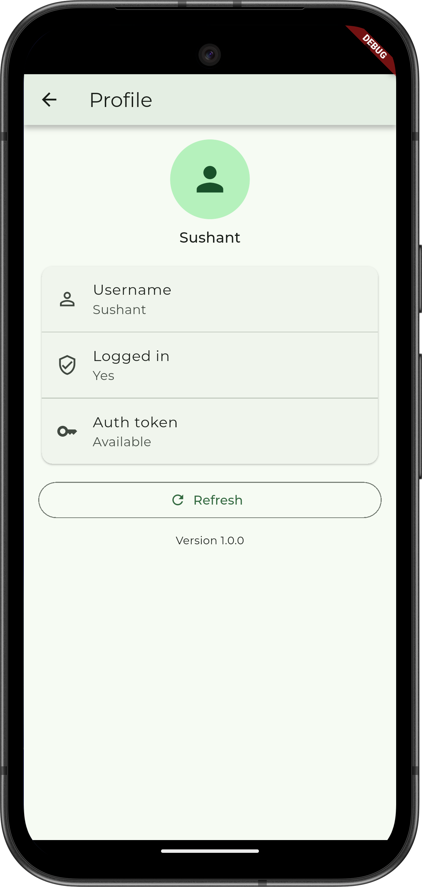

# Journal App

Journal App is a Flutter-based journaling application that lets users sign up, log in, view journal entries, and create new entries from a clean mobile UI. It includes local session state, secure token storage, and a simple profile screen that reflects the current authentication state.

## Features

- User registration and login
- Journal feed with existing entries
- Create and submit new journal entries
- Profile screen with stored user/session details
- Local persistence for login state and auth token

## Tech Stack

- **Flutter** / **Dart**
- **Provider** for app state management
- **Dio** for API requests
- **SharedPreferences** for lightweight local persistence
- **Flutter Secure Storage** for auth token storage
- **Google Fonts** for UI typography
- **Intl** for date and formatting utilities

## Project Structure

- `lib/main.dart` – app entry point
- `lib/routes.dart` – route configuration
- `lib/network/` – API constants and networking helpers
- `lib/data/` – local storage and data services
- `lib/presentation/` – screens and UI widgets

## Backend

The app is configured to talk to a backend hosted at:

`https://journalapp-s2aw.onrender.com`

API paths currently used by the app include:

- `/public/signUp`
- `/public/login`
- `/journal/getJournalEntries`
- `/journal/addJournalEntry`

> Note: if you point the app to a different backend, update the base URL in `lib/network/api_constants.dart`.

## Getting Started

### Prerequisites

- Flutter SDK installed
- A device/emulator or desktop target configured
- Backend service running and reachable if you are using a custom environment

### Install dependencies

```bash
flutter pub get
```

### Run the app

```bash
flutter run
```

If you have multiple devices connected, list them first:

```bash
flutter devices
```

Then run on a specific target:

```bash
flutter run -d <device_id>
```

### Optional checks

```bash
flutter analyze
flutter test
```

## Screenshots

The following screenshots are available in the `screenshots/` folder:

| Screenshot  | Preview                                            |
|-------------|----------------------------------------------------|
| Login       |              |
| Sign up     |           |
| Home        |                |
| Add journal |  |
| Profile     |          |

## Notes

- This repository is configured with `publish_to: 'none'`.
- Authentication data is persisted locally, so previously logged-in users may remain signed in until they log out or clear app storage.
- The profile screen displays the current stored user name, login flag, and whether an auth token is available.

## Contributing

If you extend the app, please keep the README updated with any new setup steps, environment variables, or screenshots.
